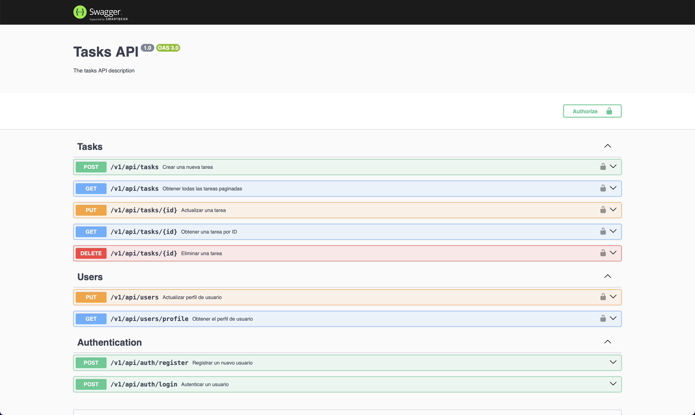

<p align="center">
  <a href="http://nestjs.com/" target="blank"></a>
</p>

[circleci-image]: https://img.shields.io/circleci/build/github/nestjs/nest/master?token=abc123def456
[circleci-url]: https://circleci.com/gh/nestjs/nest

## Description

Framework TypeScript repository of TASK.

```bash
src/
├── core/               # Lógica transversal y configuración base
│   ├── api/            # Módulos principales de la aplicación
│   ├── config/         # Configuraciones globales
│   ├── exceptions/     # Manejo de errores
│   ├── interceptors/   # Interceptores de peticiones/respuestas
│   ├── middleware/     # Middlewares globales
│   ├── shared/         # Utilidades compartidas
│   └── main.ts         # Punto de entrada
```

## Create env

### Can you see the example in the file env.example

```bash
$ DATABASE_URL=
$ JWT_SECRET=
$ PORT=
$ ORIGIN_URL=
$ POSTGRES_USER=
$ POSTGRES_PASSWORD=
$ POSTGRES_DB=
$ POSTGRES_PORT=
```

## Project setup

```bash
$ yarn install
```

## Docker setup

1. First install docker on your computer

```bash
$ docker-compose up -d
```

## Prisma execute

```bash
$ npx prisma migrate dev --name init

$ npx prisma generate
```

## Compile and run the project

```bash
# development
$ yarn run start

# watch mode
$ yarn run start:dev

# production mode
$ yarn run start:prod
```

## Run tests

```bash
# unit tests
$ yarn run test

# e2e tests
$ yarn run test:e2e

# test coverage
$ yarn run test:cov
```

# Run Swager

On the brower put the follow link

```bash
http://localhost:3000/api/#/
```
